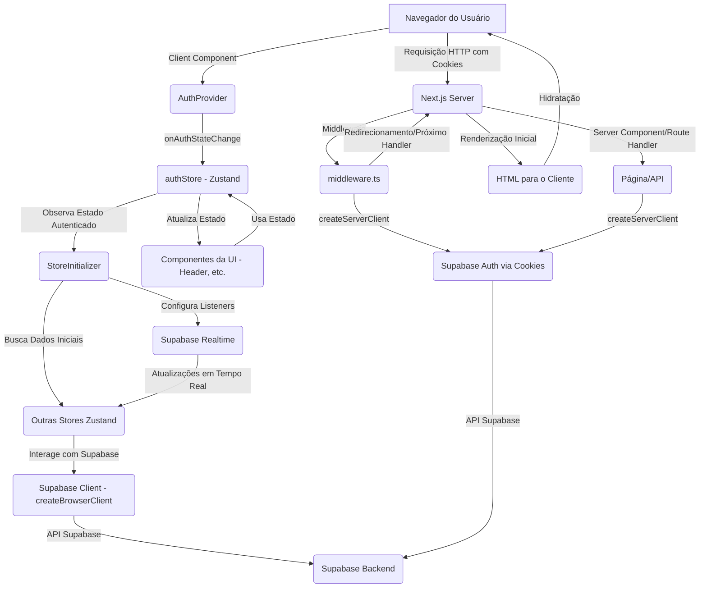

# Análise de Arquitetura e Plano de Ação para o Projeto StayFocus

Este documento apresenta uma análise da arquitetura atual do projeto "StayFocus", com foco na integração com Supabase, Next.js App Router e Zustand, e propõe um plano de ação para resolver os problemas identificados.

## Diagnóstico dos Problemas Atuais

Os principais desafios identificados na arquitetura atual do projeto "StayFocus" parecem estar relacionados à complexidade e à potencial redundância no fluxo de gerenciamento de autenticação e estado, especialmente após a refatoração para utilizar `@supabase/ssr` e integrar a autenticação ao Zustand.

1.  **Sincronização Manual da Sessão:** A chamada assíncrona para a Route Handler `/api/auth/update-session` a partir do listener `onAuthStateChange` no cliente é a causa mais provável de problemas de sincronização, condições de corrida e possivelmente o aviso "Multiple GoTrueClient instances". O `@supabase/ssr` já gerencia a sessão de forma transparente via cookies, tornando essa sincronização manual desnecessária e prejudicial.
2.  **Gerenciamento de Estado de Carregamento Complexo:** A lógica de controle do estado de carregamento (`isLoading`) no `AuthProvider` e a introdução do estado `isReady` com `setTimeout` no `Header` indicam problemas de temporização e propagação do estado de autenticação. Isso leva a dificuldades em garantir que a UI reflita o estado de autenticação de forma rápida e consistente, resultando em "flashes" de conteúdo.
3.  **Resquícios da Arquitetura Anterior:** A presença de imports e uso do antigo `AuthContext` em arquivos como `app/layout.tsx` e `app/components/utils/StoreInitializer.tsx` sugere que a refatoração para Zustand pode não ter sido completamente aplicada, criando uma mistura de abordagens que pode gerar conflitos.
4.  **Erros de RLS:** Os erros "permission denied" (RLS) que ocorreram anteriormente estavam provavelmente ligados a chamadas de dados prematuras ao Supabase, feitas antes que o cliente Supabase fosse inicializado com a sessão do usuário autenticado e o token de acesso necessário para passar pelas políticas de RLS.
5.  **Problemas de Build:** Embora os logs específicos não tenham sido fornecidos, problemas de build em projetos Next.js/Supabase/TypeScript podem ser causados por configurações incorretas de ferramentas como TypeScript, ESLint, Babel, dependências incompatíveis, ou código que tenta acessar APIs do navegador no lado do servidor sem as devidas verificações.

## Recomendações de Melhores Práticas e Respostas às Perguntas Específicas

### 1. Arquitetura Ideal para Autenticação e Sessão com Supabase e Next.js App Router

A arquitetura ideal para o gerenciamento de autenticação e sessão no Next.js App Router com `@supabase/ssr` e Zustand deve ser baseada na confiança nos mecanismos de sessão via cookies fornecidos pelo `@supabase/ssr` e na utilização do Zustand como fonte da verdade para o estado de autenticação no lado do cliente.

*   **`supabaseClient.ts`:** Deve conter a inicialização única do cliente Supabase para o **lado do cliente** usando `createBrowserClient`. A implementação de singleton com inicialização preguiçosa é uma boa abordagem para garantir que o cliente só seja criado no navegador.
*   **`supabaseServer.ts` (ou uso direto):** Utilizar `createServerClient` (ou `createRouteHandlerClient`, `createMiddlewareClient`) nos componentes e handlers do **lado do servidor** (Server Components, Route Handlers, Middleware). Esses clientes lerão automaticamente os cookies HTTP para obter a sessão.
*   **`authStore.ts` (Zustand):** Esta store deve ser a **fonte da verdade** para o estado de autenticação no cliente (`user`, `session`, `isLoading`). Deve conter os métodos para interagir com o Supabase Auth (`signIn`, `signOut`, etc.). O listener `onAuthStateChange` deve **apenas** atualizar o estado desta store. **Não deve chamar Route Handlers para sincronização manual da sessão.** A persistência no `sessionStorage` deve ser revisada para evitar o armazenamento de tokens sensíveis, confiando nos cookies para a sessão.
*   **`AuthProvider.tsx`:** Um Client Component que envolve a aplicação (geralmente no `RootLayout`). Sua principal responsabilidade deve ser inicializar o listener `onAuthStateChange` (se necessário, pois o `@supabase/ssr` já gerencia a sessão via cookies) e talvez configurar o `StoreInitializer`. Deve ser simplificado, removendo lógicas complexas de loading e chamadas a Route Handlers.
*   **`StoreInitializer.tsx`:** Um Client Component que observa o estado de autenticação da `authStore`. Quando o estado indicar que o usuário está autenticado e o processo inicial de autenticação foi concluído de forma confiável, ele deve disparar a busca de dados iniciais para as outras stores Zustand e configurar listeners em tempo real do Supabase. Deve depender diretamente da `useAuthStore`.
*   **`middleware.ts`:** Utiliza `createServerClient` para obter a sessão a partir dos cookies e proteger rotas no lado do servidor, redirecionando usuários não autenticados. A lógica atual parece adequada.
*   **`app/auth/callback/route.ts`:** Uma Route Handler que utiliza `createServerClient` para processar o código de autenticação OAuth recebido na URL e estabelecer a sessão via cookies. A lógica atual parece correta.

Diagrama Conceitual da Arquitetura Ideal:

### 2. Como Depurar Efetivamente o Aviso "Multiple GoTrueClient instances"

1.  **Remover Sincronização Manual:** Elimine a Route Handler `/api/auth/update-session` e todas as chamadas a ela. Esta é a causa mais provável.
2.  **Verificar Inicializações Duplicadas:** Faça uma busca global no projeto para `createBrowserClient` e `createServerClient`. Garanta que `createBrowserClient` seja chamado apenas uma vez no ponto central de inicialização do cliente Supabase (`app/lib/supabaseClient.ts`). `createServerClient` (ou variantes) deve ser chamado apenas nos contextos de servidor apropriados (Middleware, Route Handlers, Server Components), e cada chamada deve ser independente e usar o contexto de cookies correto.
3.  **Montagem Única do Provider/Listener:** Confirme que o `AuthProvider` (ou o componente que configura o listener `onAuthStateChange`) é montado apenas uma vez no ciclo de vida da aplicação no cliente (garantido ao colocá-lo no `RootLayout`).
4.  **Ferramentas de Desenvolvimento:** Use as ferramentas de desenvolvimento do navegador (aba Network) para inspecionar as requisições ao Supabase Auth e verificar se há chamadas inesperadas ou múltiplas inicializações.

### 3. Estratégia Robusta para o `StoreInitializer`

A estratégia mais robusta para o `StoreInitializer` é observar o estado de autenticação da `authStore` e disparar a busca de dados e configuração de listeners apenas quando o estado indicar que o usuário está autenticado e o processo inicial de autenticação foi concluído de forma confiável.

*   O `StoreInitializer` deve depender diretamente do estado `user` e `isLoading` (ou um estado similar que indique "autenticação pronta") da `useAuthStore`.
*   Remova o `setTimeout` de 100ms. A busca de dados e a configuração de listeners devem ocorrer *imediatamente* assim que o estado de autenticação confiável for detectado.
*   A lógica de migração de dados (`handleDataMigration`) deve ser chamada *após* a autenticação ser confirmada e *antes* da busca de dados iniciais, garantindo que o esquema e os dados básicos estejam prontos.

### 4. Como o `Header.tsx` Deve Reagir às Mudanças no Estado de Autenticação

O `Header.tsx` (e outros componentes da UI que dependem do estado de autenticação) deve consumir diretamente o estado `user` e `isLoading` da `useAuthStore`.

*   Remova a lógica `isReady` e o `setTimeout` associado.
*   A renderização condicional do conteúdo do Header (botões de login/registro vs. informações do usuário logado) deve depender apenas do estado `user` e `isLoading` da `useAuthStore`.
*   Quando `isLoading` for verdadeiro, renderize um estado de carregamento simplificado. Quando `isLoading` for falso, renderize com base na presença ou ausência do objeto `user`. Isso garantirá que a UI reaja de forma mais imediata e precisa às mudanças no estado de autenticação, minimizando "flashes".

### 5. Causa Raiz de Erros "permission denied" (RLS) Anteriores

Se erros "permission denied" (RLS) ocorreram mesmo com políticas de RLS aparentemente corretas, a causa mais provável é que as requisições ao Supabase (para buscar dados, inserir, atualizar, etc.) estavam sendo feitas *antes* que o cliente Supabase fosse inicializado com a sessão do usuário autenticado.

Isso significa que a requisição chegava ao backend do Supabase sem um token de acesso válido ou com um token de um usuário anônimo, e as políticas de RLS negavam o acesso aos dados protegidos. Garantir que a busca de dados e outras operações no Supabase só ocorram *após* o estado de autenticação ser confirmado (como gerenciado pelo `StoreInitializer` após as correções propostas) é fundamental para resolver isso.

### 6. Armadilhas Comuns no Deployment (Netlify/Vercel)

*   **Variáveis de Ambiente:** Certifique-se de que `NEXT_PUBLIC_SUPABASE_URL` e `NEXT_PUBLIC_SUPABASE_ANON_KEY` estejam configuradas corretamente nas configurações de build/deploy da Netlify/Vercel. Se você usar a `SUPABASE_SERVICE_ROLE_KEY` em Route Handlers para operações privilegiadas (o que deve ser feito com extrema cautela), ela também deve ser configurada como uma variável de ambiente secreta na plataforma de deploy.
*   **URLs de Callback OAuth:** As URLs de redirecionamento configuradas no Supabase (em Authentication -> Providers -> Google -> URLs de redirecionamento) devem incluir todas as URLs possíveis onde sua aplicação pode estar rodando, incluindo o domínio principal de produção e as URLs geradas pela Netlify para deploy previews (que geralmente seguem o padrão `https://[deploy-id]--[site-name].netlify.app`). A lógica no seu [`app/auth/callback/route.ts`](app/auth/callback/route.ts) para lidar com domínios Netlify é útil aqui.
*   **Middleware e Edge Functions:** O middleware do Next.js e as Route Handlers rodam como Edge Functions na Netlify/Vercel. O `@supabase/ssr` é compatível com esses ambientes, mas é crucial garantir que as variáveis de ambiente necessárias estejam disponíveis para eles.

### 7. Considerações para Integração Futura (Assistente RAG via WhatsApp)

Para integrar uma assistente RAG via WhatsApp que precise acessar os dados do usuário no Supabase, você deve considerar o seguinte:

*   **Acesso Seguro aos Dados:** A assistente precisará de uma forma segura de acessar os dados do usuário autenticado. Isso pode ser feito através de:
    *   **Edge Functions do Supabase:** Implementar a lógica de acesso a dados em Edge Functions. O cliente Supabase dentro da Edge Function pode ser inicializado com o contexto de autenticação da requisição (se aplicável) e as políticas de RLS protegerão os dados.
    *   **API Separada:** Criar uma API backend separada (talvez usando Route Handlers no Next.js ou um serviço dedicado) que a assistente possa chamar. Esta API precisará de um mecanismo de autenticação robusto (ex: tokens de API, autenticação baseada em usuário) para garantir que apenas a assistente autorizada possa acessá-la e que ela só acesse os dados do usuário correto.
*   **RLS:** As políticas de RLS no Supabase continuarão a ser a primeira linha de defesa para proteger os dados do usuário, independentemente de como a assistente acessa o banco.
*   **Performance e Custo:** Consultas complexas para RAG podem impactar a performance e o custo do banco de dados. O design do esquema e a otimização das consultas serão importantes. Edge Functions podem ser eficientes para manter a lógica de acesso a dados próxima ao banco.

## Plano de Ação Priorizado

Este plano de ação sugere os passos para estabilizar a aplicação, resolver os problemas de autenticação e build, e garantir uma base sólida para o desenvolvimento futuro:

1.  **Eliminar Sincronização Manual da Sessão:**
    *   Remover completamente a Route Handler [`app/api/auth/update-session/route.ts`](app/api/auth/update-session/route.ts).
    *   Remover a função `updateServerSession` da `authStore` ([`app/stores/authStore.ts`](app/stores/authStore.ts)) e todas as chamadas a ela (especialmente no `onAuthStateChange` dentro do `AuthProvider`).
    *   Confiar inteiramente no `@supabase/ssr` para gerenciar a sessão via cookies.
2.  **Simplificar e Corrigir o Fluxo de Autenticação no Cliente:**
    *   Atualizar [`app/layout.tsx`](app/layout.tsx) e [`app/components/utils/StoreInitializer.tsx`](app/components/utils/StoreInitializer.tsx) para importar e usar diretamente a `useAuthStore` em vez do hook `useAuth` do antigo `AuthContext`. Remover o arquivo `app/context/AuthContext.tsx` se ele não for mais necessário.
    *   Simplificar a lógica no `AuthProvider` ([`app/components/auth/AuthProvider.tsx`](app/components/auth/AuthProvider.tsx)). Ele pode se concentrar apenas em configurar o listener `onAuthStateChange` para atualizar a `authStore` e talvez lidar com redirecionamentos globais. Remover a lógica complexa de `isLoading` e `initialSessionChecked`.
    *   Simplificar a lógica de `isLoading` na `authStore`. Ela deve refletir se o processo inicial de obtenção da sessão (`getSession`) e o primeiro evento `onAuthStateChange` foram processados.
    *   Remover o `setTimeout` de 100ms no `StoreInitializer` ([`app/components/utils/StoreInitializer.tsx`](app/components/utils/StoreInitializer.tsx)). A busca de dados e a configuração de listeners devem depender diretamente do estado `user` e `isLoading` (confiável) da `authStore`.
    *   Remover a lógica `isReady` e o `setTimeout` no `Header.tsx` ([`app/components/layout/Header.tsx`](app/components/layout/Header.tsx)). A renderização condicional deve depender apenas de `user` e `isLoading` da `useAuthStore`.
3.  **Revisar Inicialização do Cliente Supabase:**
    *   Confirme que [`app/lib/supabaseClient.ts`](app/lib/supabaseClient.ts) é o *único* lugar onde `createBrowserClient` é chamado na aplicação cliente.
    *   Confirme que `createServerClient` (ou variantes) é chamado apenas nos locais apropriados do servidor (Middleware, Route Handlers, Server Components) e que cada chamada usa o contexto correto (cookies).
4.  **Refinar Gerenciamento de Estado e Inicialização de Dados:**
    *   Assegurar que a lógica de busca de dados nas stores individuais (`fetchFinancasData`, etc.) seja chamada *após* o `StoreInitializer` confirmar que o usuário está autenticado e o estado está pronto.
    *   Revise a persistência da `authStore` no `sessionStorage`. Considere persistir apenas informações não sensíveis do usuário (como ID, email, metadata) e confiar nos cookies para o estado da sessão.
5.  **Investigar Erros de Build:**
    *   Obtenha os logs de erro de build específicos.
    *   Verifique a configuração do Babel, TypeScript e ESLint.
    *   Procure por código que tenta acessar APIs do navegador em Server Components ou no topo de módulos importados no servidor sem verificações.
6.  **Testar e Depurar:**
    *   Após implementar as mudanças, teste exaustivamente os fluxos de login (email/senha e OAuth), logout, registro e acesso a rotas protegidas.
    *   Monitore os logs do console no navegador e no servidor.
    *   Use as ferramentas de rede do navegador para inspecionar requisições e cookies.
7.  **Considerações de Deployment:**
    *   Revise as variáveis de ambiente configuradas na Netlify/Vercel.
    *   Confirme que as URLs de callback OAuth no Supabase estão corretas para todos os ambientes de deploy.